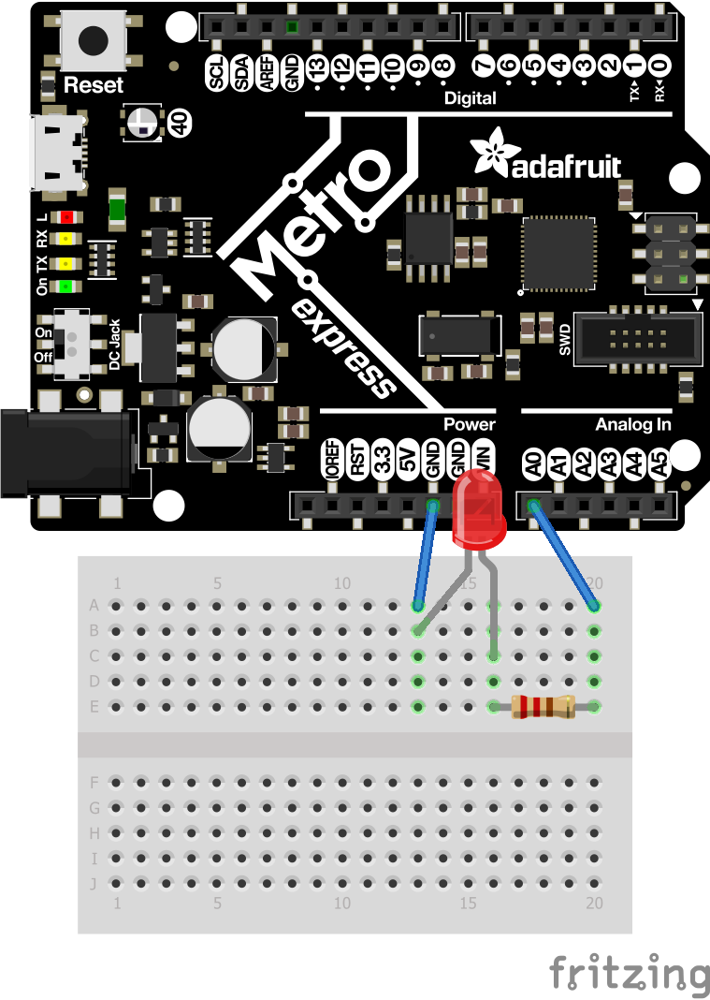
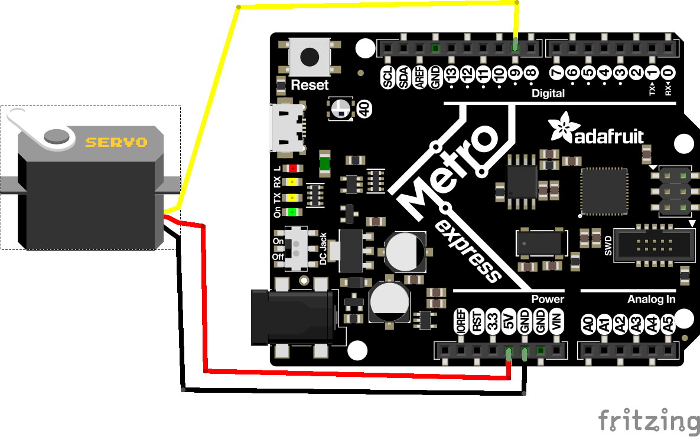
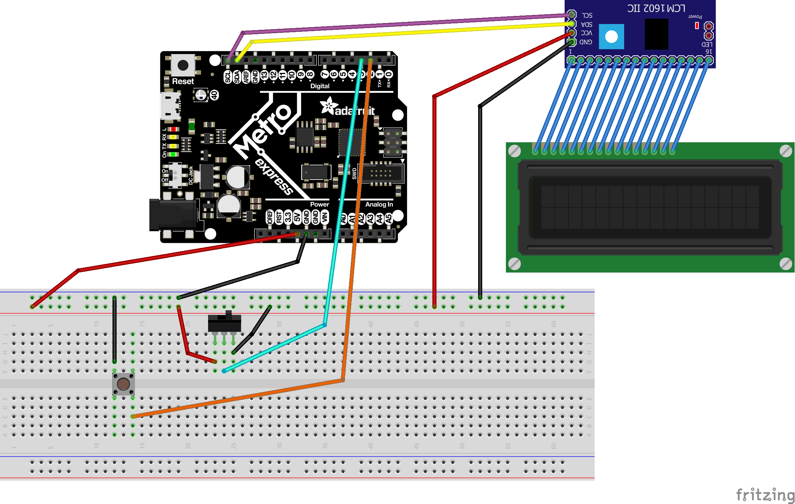
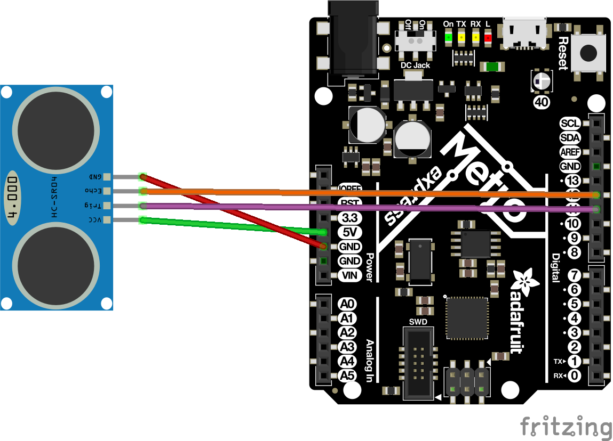
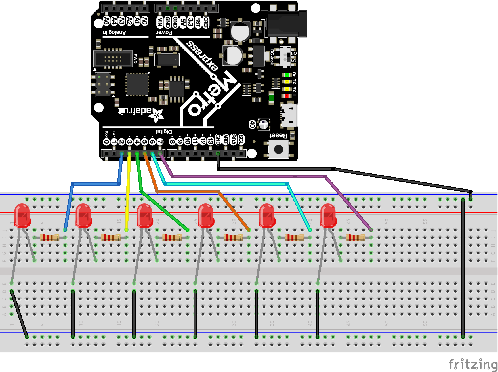

# CircuitPython
   My CircuitPython Assignments. 
   These are my CircuitPython assignments from Engineering 3
 
 
 
 
 
 
 
 
 
 ## Hello Circuit Python (and Metro and Mu)
 
 ### Description
 In this assignment, we are introduced to CircuitPython, Metro, and Mu. The objective is to make an LED fade from 0% to 100% brightness and back down.
 
 ### Lessons Learned
  This assignment was essentailly and introduction to Metro, CircuitPython, and Mu. I learned that the logic for your code will be nearly identical for an LED Fade across languages, but the syntax can be wildly different; as in the contrast between Arduino and CircutPython. Also, I learned that CircuitPython requires much more libraries to be imported than Arudino
  
 ### Images and Diagrams
 This is a Fritzing of the Wiring

   
 
 
 
 
 
 ## CircuitPython Servo (With Capacitive Touch)
 ### Description
 In this assignment, we used CircuitPythons's "Capacitive Touch" to make a Servo turn. When we touch a wire, then the servo will rotate a certain direction. If we were to touch another wire, then the Servo would rotate the other direction.
 ### Lessons Learned
 This lesson, we learned how to use PWM, as well as re-familiarizing ourselves with how CircuitPython Works. Capacitive touch was relatively easy to become accustomed to (Touch.io)
 ### Images and Diagrams
  This is a Fritzing diagram of the assignment
  
  
  
  
  
  
  
  
  ## CircuitPython LCD
  ### Description
   In this assignment, we had to print a button press on an LCD screen. On top of that, we had to add or subtract the number per press based on if a switch on the breadboard was flipped or not. On flip of the switch would count up when the button was pressed, and the otehr would count down when the button was pressed
   
   ### Lessons Learned
   In this assignment, we re-familiarized ourselves with how to wire a switch, as well as a LCD Sceren. Fortunately for us, the Metro Express has two LCD Backpack friendly ports for SDA and SCL. This means that we did not have to set any Analog Pins for the LCD Backpack
   
   ### Images and Diagrams
   
   
   
   
   
   
   
   
   ## CircuitPython PhotoInterrupters
  
 ### Description
In this assignment, we had to read interrupts in a photointerrupter, and print the ammount of interrupts every 4 seconds, WITHOUT using time.sleep().
   
 ### Lessons Learned
 I learned about time.monotonic in this assignment and used it to count the amount of seconds (intervals). We also added a switch that only adds once the photointeruppter reading is high then low, essentially functioning as a safeguard for the counter.
   
 ### Images and Diagrams
 
 
   

 ## CircuitPython Distance Sensor
 
  ### Description
In this assignment, we had to read the distance from an UltraSonic Distance Sensor (HC-SR04). After we had read the distance, we were to turn the onboard NEOPIXEL LED along a spectrum to a color that represents the distance. The distance is to also be printed to the Serial Monitor.
   
 ### Lessons Learned
This assignment taught me quite a deal about raw problem solving and Critical Thinking. The distance sensor itself was rather easy and straightforward; however, the color spectrum was the more difficult part of the project. I solved the problem by spending some time and thinking about what i want the colors to be at what distance, and how that could be mapped. I ended up using two different mapping regions as you had to bypass the halfway (15cm) distance.

   
 ### Images and Diagrams
 
  

 
 
 
 
 
 ## Classes, Objects, and Modules
 
 ### Description
 In this assignment, we leared about Classes, Objects, and Modules in CircuitPython. In the assignment itself, we had to create a library that would set an LED to a certain color when the main called for it. You fed the main certain pins, and the LED would turn itself through colors, and at the end it would fade in and out like a rainbow.
 
 ### Lessons Learned
 In this, we were introduced to Classes, Objects, and Modules. It took quite a bit of effort to get the syntax of the library correct. Eventually, we were able to decude how it was done. We also had to use PWM pins and self in order for the LEDs to turn on. The most frustrating issue was the learning curve for Self. Self must be added in your library in order to allow initialized variables to be accessed and referenced later in your library. 
 
 ### Images and Diagrams

## Hello VS Code

### Description
   In this assignment, we were introduced to Visual Studio (VS) Code. We opened VS code, created a small file, and pused that file into our CircuitPython Github Repository.  
   
  ### Lessons Learned
  Although this assignment is very straightforward on the surface level, it was actually rather difficult. VS Code does take a decent amount of familiarization in order to make sense. On top of that, I was given errors that didn't seem to have much reasoning. Eventually, I was able to work through the errors. Makes sure that your Metro is plugged in and that you have installed Python
  
 ## FancyLED
 
 ### Description
 
 In FancyLED, we had to create a library in FancyLED that had various modules that each made a set of 6 LEDs do different tasks. For example, there was a blink (all on or all off) module and a chase (one on, then off, then the next on while the intial was being turned off) module.
 
 ### Lessons Learned
 The biggest lesson I learned from this assignment was that it can be, and is likely usally, beneficial to look back at prior asssignments and work for help on your current work. More specifically, it behooved me to look at the RGB library from the "Classes, Modules, and Objects" assignment. 
 
 ### Images and Diagrams
 
 MyMedia/FancyLED_bb.png
 
 
 
 
 # Advanced Circuit Python
 
 ## Hello Processing
 
 

### Description
   In this assignment we were supposed to make a circle bounce around a small window.
   
 ### Lessons Learned
  In this assignment, I learned that planning your code instead of just writng it and troubleshooting can really help. At first, I just attempted it blindy and thought I would just figure it out. However, that did not work very well... at all. So, I took a step back from my keyboard, and really thought through the code and what lines I needed. It was very easy to transpose my new information on to the keyboard. 
  
We used sin and cos to help move the circle around the screen. We would increase the x and y coordinates by their respective sin and cos values. Once the x or y values were too high or too low (the circle his the wall), we multiplied the sin and cos by -1, which flipped the direction that the circle would go. 
  
 ### Images and Diagrams
     
   
 ## CircuitPython to Processing
  
 ### Description
 In this assignment, we had to turn a potentiometer, take that value from CircuitPython, and move it over to Processing. In processing, we had to turn an animated dial up coordinated with the real potentiometer; similar to a speedometer. 
 ### Lessons Learned
  The biggest take away for me from this assignment was not hard coding this. I instantly thought that I could just take the values from the potentiometer and hard code some coordinating lines on the speedometer when the potentiometer is within the threshold. However, I felt that this was not up to standard. So, this taught me that even if you think you know a way to do a task, it is not always the best way; it is smartest to take some time to develop different solutions to the same problem.
  
 My solution was once again using sin and cos to make the line on the speedometer turn. Our speedometer went from horizontal left to horizontal right (Due west to Due East). For this, we also made it so that horizontal left was equal to 0 on the potentiometer, and 180 was horizontal right. Then we multipled a constant by sin or cos of the potentiometer input to create the coordinates. For example, (-150cos(theta), 150sin(theta)). The negative before the cosine helped keep the dial within the range we wanted it visually. 
 ### Images and Diagrams
 
 ## Processing to CircuitPython
 
 ### Description
 The goal of this assignment was the make a GUI on Processing, and transpose information, based on the location of your cursor, to the Metros. Then, move two servos that correspond to the location of your cursor.
 ### Lessons Learned
 Once again, I do not have access to the code since I didn't upload it before school was suspended. So I will go off of what I remember. The lesson that I learned from this was about how to troubleshoot. I spent a week or so trying to get the decoding from the Processing onto the Metro adn CircuitPython. This ended up being the trickiest part of the assignment. We eventually surmounted this obstacle by working together. Me, and my 3 neighbors, all sat around the computer, and brainstormed. For two days, we all gave our thoughts and ideas. Eventually, we were able to solve the decoding issues.
 
 For a more material lesson learned, we learned to limit the amount of variables in your code. This sounds easy, but we ended up having 2 different variables for the coordinates, one a string and one an int; when we could've just said str(variable) and int(variable).
 ### Images and Diagrams
 

